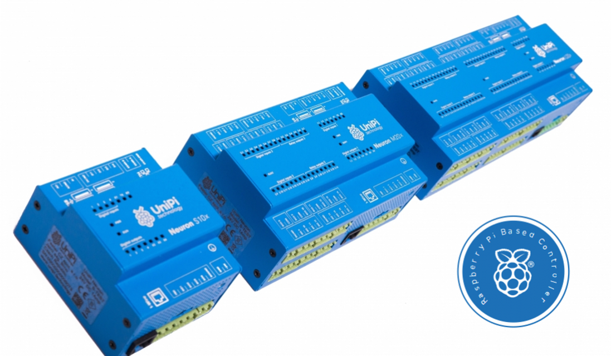
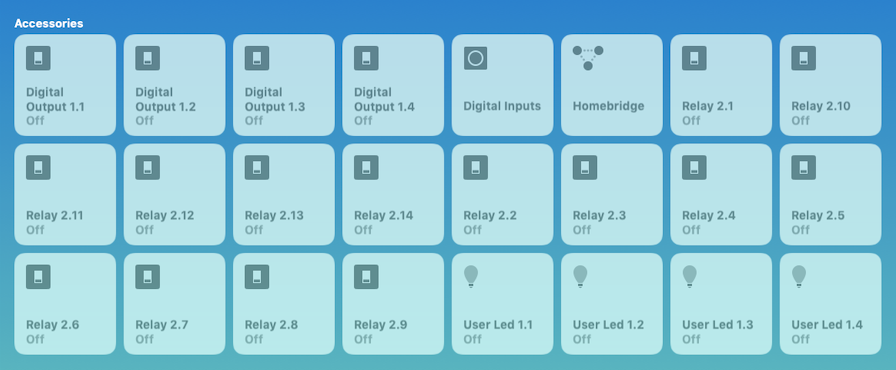

[](https://badge.fury.io/js/homebridge-unipi)
[](https://travis-ci.org/blackbit-consulting/homebridge-unipi) 
# About this plugin

This library provides a [homebridge](homebridge.io) **platform plugin** for the [UniPi](https://unipi.technology) [Neuron](https://www.unipi.technology/products?category=2) series of devices. Although the Neuron devices come with a set of supported software, they are not HomeKit compatible. It is possible to expose them to HomeKit via third party domotics platoforms, but that still requires you to do quite a bit of manual configuration and tweaking.

The purpose of *this* plugin library is to expose <u>all</u> (or as much as possible) of the default features of a UniPi device as a single HomeKit Accessory with automatically detected services for all of the features. I also added some extras...


_**Copyright & Source**: [UniPi.technology](https://unipi.technology) - With permission from the copyright owner_

# State of development

This is a work in progress, but a lot already works ;-). Enough for a first 1.0.0 release:



## State preservation

The plugin supports *preservation of device state* accross plugin or homebridge restarts and reconnects. Upon startup, the plugin will restore the current device state, instead of propagating default values to the devices.

## Connection state tracking - virtual contact sensor

Due to HomeKit no longer supporting the '*Reachability*' characteristic, i've added an optional (configurable) contact sensor to indicate the connection state to the Evok API.

Whenever the plugin get's disconnected from the Evok API (due to UniPi changing IP or rebooting etc.) the contact sensor state will change to **open** (which is the warning state). This way, it is possible to respond using automation as well.

## Multiple devices

The plugin supports multiple UniPi/Evok endpoints, with separate configuration.

## Maintenance mode

The plugin exposes a 'maintenance mode' virtual switch. Setting the maintenance mode will allow you to do the following things:

- Trigger pulse timers *without updating the associated virtual impulse relay* (for correcting the impuls relay state if it is wrong)
- Manually change a virtual pulse relay's state, *without triggering the corresponding digital output*, for the same reasons as above.

# Supported UniPI Services

## Digital inputs

The digital inputs of the UniPi devices are **detected automatically**, and exposed as **Programmable Stateless Switches** by default. They support **SINGLE**, **DOUBLE** and **LONG** press events, and can be used to trigger automations. The long press events will repeat if you keep pressing the button linked to the digital input.

> **Note**
> For the double press feature to work properly, you may need to tweak the debounce value for the digital inputs to a value that suits your montary switches. You can do that via the Evok UI, in the Configuration tab. Otherwise, you may miss a some double click events, as the down event won't be seen.

> **==TODO==**
> I *intend* to allow for further configuration, in order to support both stateless and stateful (on/off) switches.

## Digital & Physical relay outputs

Both the digital (Transistor) and physical relay outputs of the UniPi devices are detected automatically, and exposed as **switches**. They can be reconfigured within the iOS App as lights or fans.

### Extra: Relay Timers

The relay outputs can be linked to a 'timer'. In that case, when the ouput is switched on, the timer will start, and turn the output off again after a configurable delay (unless otherwise switched off before that delay). The timer can be set to a very short time, like 250 ms, in order to provide a 'pulse' to for example an external impulse relay.

> **Note**
> Timers are also activated when a relay output is triggered from outside HomeKit (Evok or another channel)

```json
{
"...collapsed stuff",
"timers": [
    {
        "relayType": "physical",
        "circuit": "2_09",
        "timeout": 120000,
        "name": "Hallway lights 2 min timer"
    },
    {
        "relayType": "digital",
        "circuit": "1_04",
        "timeout": 200,
        "name": "Bathroom ventilation",
        "pulse": true
    }
]
}
```

### Extra: Virtual Impulse Relay

Sometimes, you'll want to use a relay output to trigger another external relay. If this relay is an *impulse relay*, it will not require a constant current to keep the relay closed. Instead, a short pulse to make it change state is sufficient. This poses one problem: the trigger output will change back to off state, and you won't be able to see if the triggered relay is in 'on' or 'off' state. Enter '<u>virtual impulse relays'</u>.

 When setting up a a timer with a very short 'pulse' timeout, you can add the property `"pulse": true`, and an optional property `"name": "whatever"`. In that case the timer will construct an additional **virtual impulse relay** (switch service), that will **toggle on and off automatically** whenever the relay linked to the timer is switched on. This will allows you to track the on-off state of the impulse relay, provided that the initial state is correct. If not, you can manually correct the state.

When you directly change the state of a **virtual impulse relay** in the Home app, it will **automatically trigger the linked relay output** and therefore effectively change the device state (unless in maintenance mode). This way, you can directly interact with the virtual device, instead of via the triggering output.

The below diagram demonstrates the sequence of this flow.

```sequence
Home App -> Virtual Relay 2.1: TOGGLE
Virtual Relay 2.1 -> Timer 2.1: IGNORE NEXT TOGGLE
Virtual Relay 2.1 -> UniPi: SET RO 2.1 ON
Virtual Relay 2.1 --> Home App: TOGGLED
UniPi -> External Impulse Relay: PULSE
External Impulse Relay -> External Impulse Relay: TOGGLE
UniPi --> Relay 2.1: IS ON
Relay 2.1 -> Timer 2.1: START
Relay 2.1 -> Timer 2.1: TOGGLE (IGNORED)
Timer 2.1 -> Timer 2.1: TIMEOUT
Timer 2.1 -> Relay 2.1: SET OFF
Relay 2.1 -> UniPi: SET RO 2.1 OFF
UniPi --> Relay 2.1: IS OFF
```

## User leds

The UniPi has 4 user accessible LED's (X1 to X4). These user leds are <u>detected automatically</u>, and exposed as **light bulbs** with on/off state. User LED **X1** is used during the Home App's *device identification* process, where it will rapidly blink 20 times.

## Extra: Virtual 'Connection' contact sensor

You can configure an additional virtual **contact sensor** service to expose the connection status of the Evok API. This way, it is possible to respond

## Updates to device states

The device states are updated automatically when changed by an external event (for example a user manually using the evok API).

# Installation
Installation is very straightforward, and it is possible to configure more than one Neuron device.

1. Create a homebridge user

   ```bash
   # We're creating a system user in this case, but with a home directory!
   sudo useradd -r -s /bin/bash -d /var/lib/homebridge -m -c "HomeBridge User" homebridge
   ```

2. Become the homebridge user, and create the necessary configuration.

   ```bash
   # Switch users
   sudo -i -u homebridge
   
   # Make the .homebridge folder
   mkdir .homebridge
   
   # Create and edit the configuration file (see below)
   vi .homebridge/config.json
   
   # Return to your own user
   exit
   ```

3. Install homebridge globally
```bash
sudo npm -g install homebridge
```

2. Install the plugin globally
```bash
sudo npm -g install homebridge-unipi
```

3. If you didn't do so before, edit your `/var/lib/homebridge/.homebridge/config.json`, and add a platform in the `platforms` array:
```json
{
  "...": "Collapsed stuff",
  "platforms": [
    {
      "platform": "UniPi",
      "endpoints": [
        {
          "id": "m203-sn001",
          "name": "Demo UniPi Neuron M203",
          "host": "m203-sn001.local",
          "port": 80,
          "wsPort": 8080,
          "connectionSensor": true,
          "doublePressMaxDelay": 500,
          "longPressMinDelay": 1000,
          "timers": [
            {
              "relayType": "physical",
              "circuit": "2_09",
              "timeout": 120000,
              "name": "Hallway lights 2 min timer"
            },
            {
              "relayType": "digital",
              "circuit": "1_04",
              "timeout": 200,
              "name": "Bathroom ventilation",
              "pulse": true
            }
          ]
        }
      ]
    }
  ]
}
```
> **Note**: ALL parameters except the **name** are optional. The values above show the defaults, except for the host. The default host is **localhost** (HomeBridge running _on_ the UniPi device).
>
> The above example exposes 2 timers. The first one is a classical timer that will turn off the physical relay 2.9 after 120000 ms (2 min). The second one is a *pulse* timer that will turn off the digital output 1.4 after 200 ms (a short pulse). The output will however trigger a virtual pulse relay (switch) for the bathroom ventilation. With every pulse, that relay will toggle state, allowing you to track the 'Bathroom ventilation' switch.

> **Note**
>
> If you do NOT install homebridge on the UniPi device, you must configure the Evok API to listen on another address than 127.0.0.1 or ::1. You can change this in the nginx configuration on the UniPi.

## Startup

I recommend starting HomeBridge using a [Systemd Service unit](https://access.redhat.com/documentation/en-us/red_hat_enterprise_linux/7/html/system_administrators_guide/sect-managing_services_with_systemd-unit_files) if supported by your OS.

Edit `/etc/default/homebridge`
```
# Override data dir
# HOMEBRIDGE_OPTS=-U /var/lib/homebridge/.homebridge

# Uncomment to enable debug mode
# DEBUG=*
```

Edit `/etc/systemd/system/homebridge.service`
````systemd
[Unit]
Description = HomeBridge Service

[Service]
Type = simple

# Run as the homebridge user
User = homebridge

# Set env variables in the below file
EnvironmentFile = /etc/default/homebridge

# Start homebridge with env $HOMEBRIDGE_OPTS from env file
ExecStart = /usr/local/bin/homebridge $HOMEBRIDGE_OPTS

Restart = on-failure
RestartSec = 10
KillMode = process

[Install]
WantedBy = multi-user.target
````

Run `sudo systemctl daemon-reload && sudo systemctl enable homebridge.service && sudo systemctl start homebridge` to enable and start homebridge.

Run `sudo journalctl -u homebridge` to view the logging.

# Updates

In order to update either HomeBridge or the plugin, simply execute:

```bash
# Update all globally installed npm libraries
sudo npm -g install npm && sudo npm -g install homebridge-unipi

# If updated, restart homebridge
sudo systemctl restart homebridge
```


# License & Copyright
The software is released under the [LGPLv3](https://choosealicense.com/licenses/lgpl-3.0/), and copyrighted &copy;2018 by **Daan Kets**.
